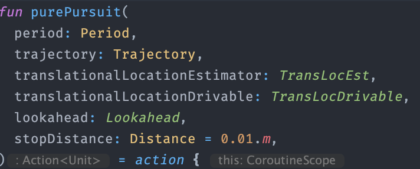

# ezAuton

- [Target Audience](#target-audience)
- [Showcase](#showcase)
    - [Network Table Modification](#modifications--network-tables)

## Target Audience

Here are some use cases where ezAuton would and wouldn't be a good idea to use

- ✅ **Creating a codebase that will run on FTC, FRC, and simulations without modifications**
- ✅ **Type safety—designed around units**
- ❌ **Using a Java only codebase.** ezAuton uses Kotlin heavily due to the multiple advantages it gives, particularly with suspending functions (approximately equivalent to async/await), and DSLs
- ✅ **Likes the idea of structured concurrency and coroutines**
- ✅ **Wanting to work on robot code without a physical robot**
- ✅ **Recording/streaming robot telemetry data**
- ✅ **Playing back or live viewing robot telemetry data**
- ✅ **Using trajectory control algorithms with minimum boilerplate**
- ✅ **Programming an FTC Robot**
- ✅ **Programming an FRC Robot**

## Showcase
The following example is all that is needed for a simulation running pure pursuit that is 
recorded. Note **this is very similar for any trajectory algorithm, I am aware pure pursuit is inferior to other methods like ramsete**.

1. Create a trajectory. 
   - Note the use of extension properties like `.m, .mps, .mps/s = .mpss`. The library uses 
     units, and they can *usually* be multiplied, added, or divided together as one would do in maths or physics. The values stored in each container is the SI value. If someone wanted
     to use feet instead of meters, they could use `.ft` and likewise for other units.
   - Trajectories contain a path which is comprised of path segments (in this case linear path segments)
   - Trajectories also contain a speed at any distance along the path
    - We specify starting, stopping points, and acceleration/decelerations.
    - The trajectory will attempt to optimize time for given constraints (deceleration at last moment)
    - The trajectory generates sub-trajectories every 5ms which are linearly interpolated between
    
2. Create a simulated robot. 
   - A simulated robot implements **a lot** of interfaces. This is useful
   because this library is built around interface and not implementation. Trajectory algorithms
   and other functions almost always accept an interface, so the library is flexible to any implementation. 
   
   
    -  Notice that some of the interfaces are oddly named. Generally, abbreviations are used at a minimum, but to avoid extraordinarily long names, a few are used. For example 
        -  Rot = Rotation
       -  Vel = Velocity
       -  Trans = Translational
       -  Loc = Location
       -  Est = Estimator

3. Create a lookahead that scales with the speed of the robot
    - `robot` implements `TankRobotVelEst`, an interface which in 
    turn implements `VelocityEst`, so it can be passed into velocity estimator 
      
4. Create a pure pursuit action. 
   - This uses a useful extension function to allow for less
boilerplate.
   - The extension function depends on any classes which implement both 
    `TransLocEst` and `TransLocDrivable`. This means that the robot can estimate
     its translational location _and_ drive towards any given translational location. 
     The tank robot implementation of `TransLocDrivable` implements this by driving in arcs.
     
    - If there is no common interface, it is easy to use the regular non-extension version
   

      
5. Record anything inside the scope into a _Recording_ object which can be saved
6. Include the data of the path. Currently, only a simple representation of the path which 
is just a list of points can be serialized. This is because paths can contain any type of
   path segments---including weird shapes such as curves, which might be hard to serialize
   and even harder to display in a visualizer
   
7. Run pure pursuit in parallel (so we can sample and run pure pursuit at the same time). 
   - Pure pursuit sees that it is in a recording scope and records data each time it loops
8. Sample data (such as location) every 10 milliseconds.
   - robot implements `Sampler<Data.TankRobotState>`, so it can be sampled
9. Save the data to a json file located in `test.json`

### Modifications — Network Tables

- If we wanted to send over network tables, we would not want to serialize all the data
at once. We would instead want to have a packet-approach. In reality, both recording 
  and packet approaches are very similar, as the way this library is designed the 
  recording is just a list of packets.
  
